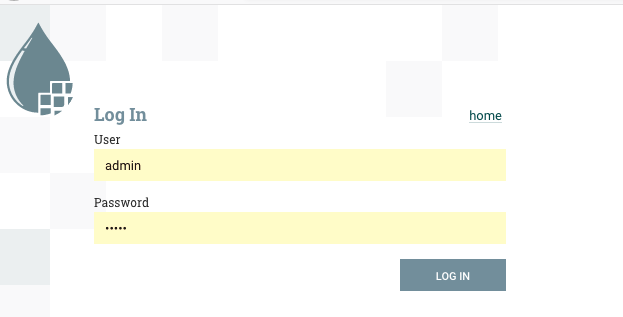

# Kubefi

Kubernetes Operator for Apache NiFi designed for NiFi cluster deployment.

## Features

- CRD-based deployment of Apache NiFi cluster
- Bring-your logback.xml configuration
- Bring-your TLS certificate for NiFI LDAP Authentication  
- Basic NiFi and ZooKeeper Pods settings
- NiFi template customization via HOCON config, no code changes needed (see conf/nifi.conf)

## Getting Started

First of all, clone this repo to get all the test example-related configs (certificates, logback.xml, LDAP).

### Deploy Kubefi Operator

```bash
make install
```

### Deploy example

Save the following YAML content as a file:

`my-nifi-deployment.yaml`:

```yaml
apiVersion: io.github.novakov-alexey/v1
kind: NiFiDeployment
metadata:
  name: my-nifi
spec:
  image: apache/nifi:1.11.4
  storage_class: default
  nifiReplicas: 1
  ingress: 
    host: minikube  # set the host to your DNS name 
    ingress_class: nginx 
  ldap:
    host: ldap://ldap-service:389
  zk:
    replicas: 1
    image: zookeeper:3.5.5
  # custom logback.xml is referenced below
  loggingConfigMap: custom-logback-config
  nifiResources:
    jvmHeapSize: 1g
    requests:
      cpu: 200m
      memory: 1Gi
```

Common and default properties for any NiFiDeployment resource can be configured as part of
Kubefi deployment. See latest file at `conf/nifi.conf`

#### Deploy dependencies

Above example is using LDAP as NiFi authentication method, fake TLS certificate 
and custom logback.xml to override default logging configuration deployed by the operator.

##### Create namespace

```
export NAMESPACE=test
kubeclt create namespace $NAMESPACE
```

##### Custom logback.xml

We deploy custom `logback.xml` for NiFi cluster as separate configmap:

```bash
kubectl create -f examples/custom-logback-cm.yaml -n $NAMESPACE
```

##### Create TLS certificate

Current project provides Makefile. 
Either copy commands from it for task `create-tls-secrets` or just run this task to create
test(fake) TLS certificates:

```
// IMPORATN: Change EXAMPLE_NAMESPACE variable in the Makefile to point to your $(NAMESPACE) defined earlier. 
make create-tls-secrets
```
It will create two Kubernetes secrets containing:
 - JKS files from a fake TLS certificate and key
 - Passwords for them  

```bash
 kubectl get secret -n test                                                                                                                                                       1 ↵  5788  20:14:24 
NAME                  TYPE                                  DATA   AGE
nifi-tls-jks          Opaque                                2      17d
nifi-tls-pwd          Opaque                                3      17d
```

##### Create Test LDAP instance

```bash
kubectl create -f ldap/ldap-deployment.yaml -n $NAMESPACE
kubectl create -f ldap/ldap-service.yaml -n $NAMESPACE
```

#### Create NiFiDeployment resource

```bash
kubectl create -f my-nifi-deployment.yaml -n $NAMESPACE
```

Above NiFiDeployment resource will result into the following Kubernetes resources:

##### Ingress

```bash
kubectl get ing -n test                                                                                                                                                                5780  19:52:20 
NAME              CLASS    HOSTS                ADDRESS   PORTS   AGE
my-nifi-ingress   <none>   <your DNS name here>             80      12s
```

##### ConfigMap

```bash
kubectl get cm -n test                                                                                                                                                           1 ↵  5783  19:54:47 
NAME                    DATA   AGE
custom-logback-config   1      16d
my-nifi-config          9      2m36s
my-nifi-zookeeper       3      2m37s
```

##### Pod

```bash
kubectl get po -n test                                                                                                                                                                 5784  19:54:51 
NAME                    READY   STATUS    RESTARTS   AGE
ldap-5bf8b6cc87-cwl5b   1/1     Running   0          16d
my-nifi-0               4/4     Running   0          6m16s
my-nifi-zookeeper-0     1/1     Running   0          6m16s
```

##### StatefulSet

```bash
kubectl get sts -n test                                                                                                                                                                5785  19:58:32 
NAME                READY   AGE
my-nifi             1/1     12m
my-nifi-zookeeper   1/1     12m
```

##### Service

```bash
kubectl get svc -n test                                                                                                                                                                5786  20:05:35 
NAME                         TYPE        CLUSTER-IP    EXTERNAL-IP   PORT(S)                      AGE
ldap-service                 ClusterIP   10.0.217.70   <none>        389/TCP,636/TCP              16d
my-nifi                      ClusterIP   10.0.15.84    <none>        443/TCP                      13m
my-nifi-headless             ClusterIP   None          <none>        9443/TCP,11443/TCP           13m
my-nifi-zookeeper            ClusterIP   10.0.224.67   <none>        2181/TCP                     13m
my-nifi-zookeeper-headless   ClusterIP   None          <none>        2181/TCP,3888/TCP,2888/TCP   13m
```

#### Test NiFI via UI

Open NiFi UI based on your ingress resource hostname:

```bash
kubectl get ing -n test                                                                                                                                                                5789  20:21:20 
NAME              CLASS    HOSTS                ADDRESS       PORTS   AGE
my-nifi-ingress   <none>   <your DNS name>   20.54.226.9   80      29m
```

Take Ingress host to open the NiFi UI at `https://<your DNS name>/nifi/`:



In case of using provided test LDAP deployment, enter admin/admin to login:


#### Cleanup

Remove NiFi deployment example:

```bash
kubectl delete -f examples/my-nifi-deployment.yaml -n $NAMESPACE
```

Remove Kubefi:

```bash
make uninstall
```